# ECE383 Final Project
## How Not to Use an Omnivision Camera 
### Bradford Hurt
***

## 1 Plan

### 1.1 Objective statement
This project attempted to create a motion tracking “gun” compatible with the ARCADE cabinet. The “gun” was to be a handheld infrared (IR) reflector detected by a camera to allow motion controls. After several failed attempts to interface with the OV7675 camera, the focus of the project became getting any usable output from the device. Had the project worked, it would have presented an RGB565 camera output for future projects.

### 1.2 Requirements
For minimum functionality, this project must interface the ARCADE cabinet’s NES controller and a camera with the Nexys Video, demonstrating the ability to receive inputs from both peripherals. The NES controller code will be provided by the instructor. B-level functionality will include basic blob tracking from the camera, with the ability to track the coordinates of one IR reflection in the camera’s field of view. A-level functionality will add tracking for a second IR point, along with the math to determine distance from the screen. This information will be used to display crosshairs on screen.

### 1.3 Level-0 Description and Top-Level Design
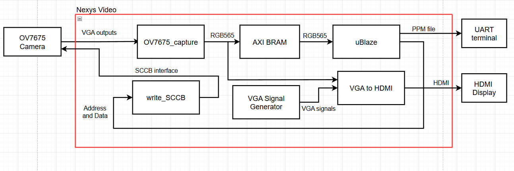

The Level-0 Block Diagram shown above outlines the basic design of the OV7675 interface. The OV7675_capture will take the data lines from the camera, convert them into RGB565 data, and load them into the AXI BRAM component. MicroBlaze will be able to read from BRAM through the automatically generated BRAM interface. Write_SCCB contains a state machine that can write to registers on the OV7675 by generating the correct waveform. The VGA components output the RGB values directly, without proper alignment, for debugging purposes.

## 2 Detailed Design

### 2.1 Level 1 Architecture
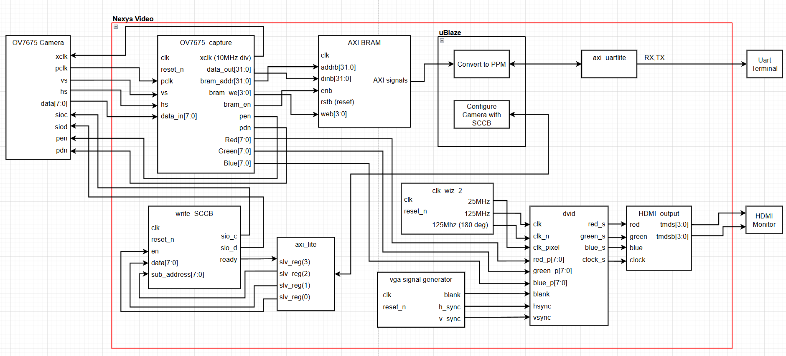

The Level-1 Block Diagram above shows how every custom component in the project is connected. For compatibility with MicroBlaze, there is no top-level design file. Components were instantiated as RTL blocks in the Vivado block diagram and wired graphically.

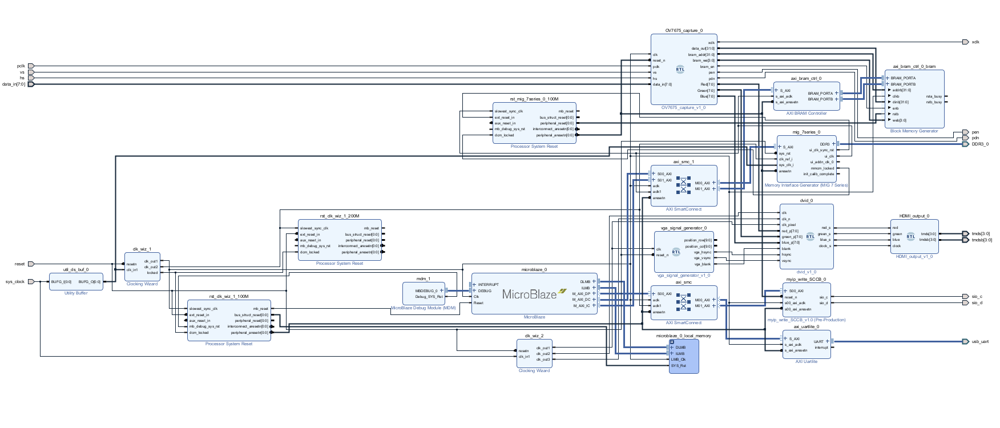

The Vivado Block Diagram above represents the final form of this project, including some pre-built components omitted from the following section.

### 2.2 Components

#### OV7675 Camera
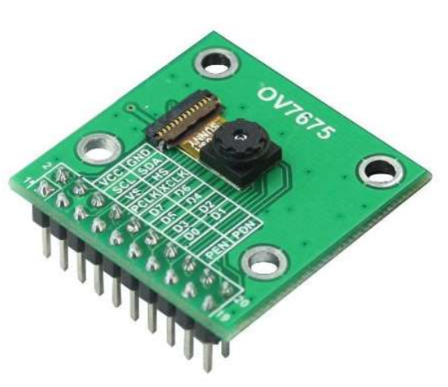

The hardware used was an OV7675 camera mounted on a breakout board designed for the Arduino Giga R1. The SCCB interface is simplified to the 2-line protocol by internally keeping the enable pin active. The VGA signals are simplified to only use Vsync and Href, labelled VS and HS. Based on preliminary testing with the Moku and information from the datasheet, the camera appears to output YUV 4:2:2 signals by default.

#### OV7675_capture
This module includes three state machines intended to execute the power-on sequence for the camera, convert YUV4:2:2 inputs into RGB565 outputs. This approach was intended to bypass the SCCB interface on the camera, eliminating one layer of complexity in startup. However, this design only produces garbled output, and the true default camera output is unclear. The OV7675_capture module also generates a 10MHz xclk signal that is wired to the camera. The Red, Green, and Blue signals are direct outputs of the converted values that are sent to the HDMI output for further debugging.

##### Startup FSM
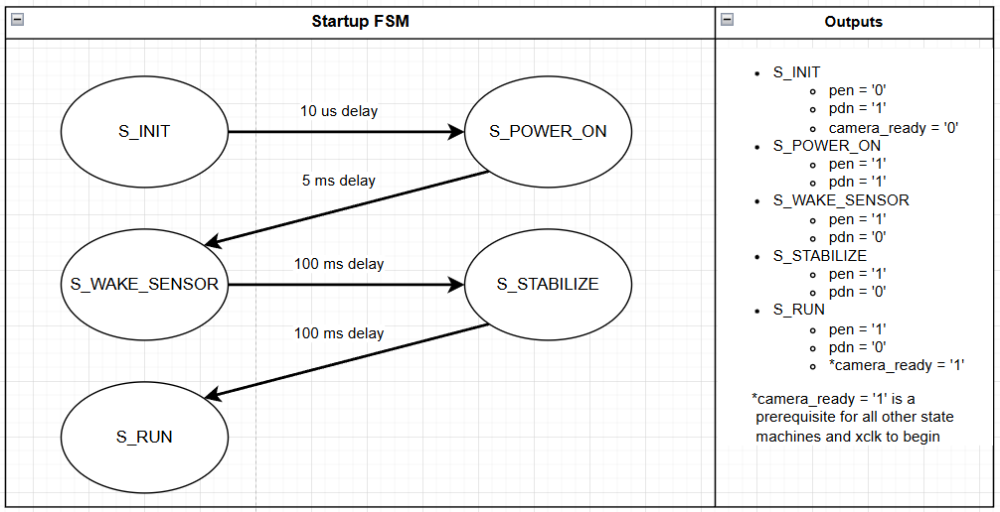

This statemachine executes only once to startup the camera according to the datasheet requirements for the startup sequence. It manipulates the pen and pdn pins to hopefully get the camera into its default startup state. The state machine then activates the camera_ready flag, allowing the other two state machines to run.

##### YUV Capture FSM
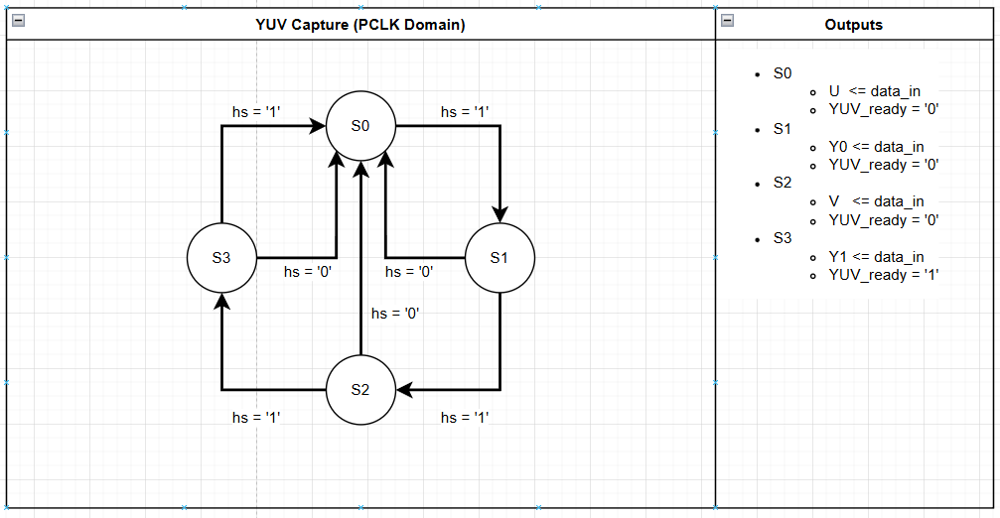

The YUV capture FSM runs in the pclk domain. The pclk signal is generated by the OV7675 hardware using the xclk input. pclk is simply a xclk returned with a slight phase shift. When the FSM reaches the S3 state, all 4 YUV4:2:2 signals have been loaded into signals and are ready for the RGB calculation. However, the difference in clock phase requires a cross-domain synchronizer, YUV_ready, to ensure that the RGB state machine only runs once per YUV input. Due the the faulty Vsync outputs from the camera, this state machine also counts the number of Hsync pulses, resetting the pix_count variable after every 492 Hsync cycles.

##### RGB Output FSM
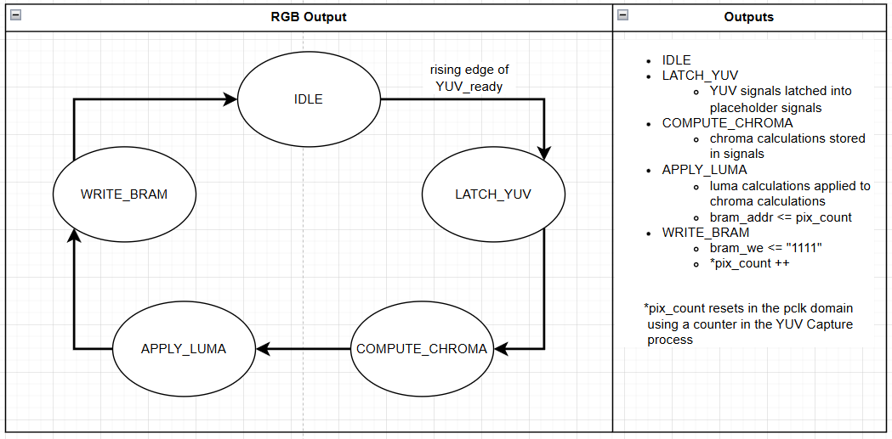

The RGB output FSM runs once for every rising edge of YUV_ready. Because this FSM is clocked using the 100MHz system clock, it runs ten times faster than the YUV capture FSM. This allows us to split the calculations into multiple clock cycles to prevent timing issues in Vivado. On the last state, it writes the calculated values to BRAM and increments the pix_count (BRAM address).

#### write_SCCB
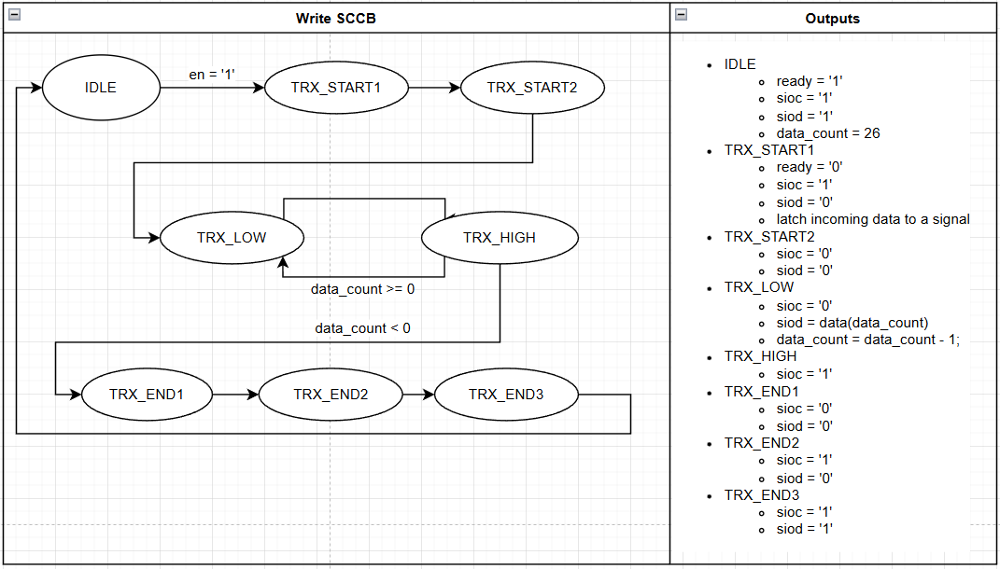

The Write SCCB FSM waits for commands from MicroBlaze, making it accessible from a command in C. When the enable, en, is turned on, the state machine generates a waveform that writes the data inputs to the address at the subAddr register. These are only shown in the state machine as a single 27 bit data signal because the SCCB requirements indicate that these should be written in sequence. The sub-address and actual data are concatenated and written in sequenc through the FSM.

#### AXI BRAM
Rather than instantiate the BRAM within a top-level design and create a custom AXI IP, BRAM was instantiated as a pre-built AXI component separate from the OV7675 capture module. This considerably simplifies the setup process for the BRAM as it can simply be dragged in, configured, and wired in the GUI. The Vivado connection automator connected it to MicroBlaze. It has 1 megabyte of memory to allow one 640x480 RGB565 frame to be stored.

#### dvid
The DVID component is copied from the Video component found in Lab 2. It was instantiated as an RTL module in the Vivado block design.

#### HDMI_output
This module was constructed to handle the OBUFDS components found within the Video file. A new file was necessary to complete the HDMI output calculation inside of the Vivado block design.

#### vga signal generator
This module is copied from the Video component found in Lab 2. It generates a vga signal that allows visualization of the Red, Green, and Blue signals from th OV7675_capture module. While the signals are not aligned with the OV7675 module, it still allows the colors to be displayed live on screen for visual confirmation.

#### clk_wiz_2
The clock wizard generates the three clock signals necessary for the vga signal generator to run. It was created using the same specifications found in Lab 2.

### 2.3 Calculations
The primary assumption made during the design of this project was that the OV7675 outputs YUV4:2:2 by default. Thus, when writeSCCB failed, a conversion system from YUV to RGB565 was created in an attempted to get useful output from the camera. The full conversion equations are shown below.
$$ R = Y + 1.403 * V' $$
$$ G = Y - 0.344 * U' - 0.714 * V' $$
$$ B = Y + 1.772 * U' $$
The camera outputs eight bits of serial data. The assumption is that YUV data comes in sequentially as Y0, U, Y1, V, where the Y1 and Y0 pixels are light values for the first and second pixels and U and V are color data shared between the first two pixels. To get each pixel separately, the Y in the equations is substituted for Y0 and Y1.

### 2.4 MicroBlaze C Code
Two main C functions were written in MicroBlaze to test the design. The first is write_SCCB, which loads the sub_addr and data to the write_SCCB hardware, then sets the enable flag to output the data. The sub_addr, or sub-address, is the location of the register that the data will be written to. The function waits for the ready flag from write_SCCB before sending the next command.

The second function is the printFrameDownsample, which divides the 640x480 RGB565 image stored in BRAM into a 64x48 image by iterating through the BRAM and printing the RGB values in a Portable Pixmap (PPM) format. The PPM format is a highly inefficient, human-readable format that makes debugging for this project simpler.

## 3 Implementation

### 3.1 Milestone I
The original Milestone I requirement was to establish an interface with the OV7675 camera to read image data from a UART terminal. The requirements also included outputting frame data to the UART terminal in a Portable Pixmap (PPM) format and interfacing an NES controller for camera calibration.

Of these requirements, only the conversion to a PPM format was successfully completed. Useful data was never retrieved from the camera, and the NES controller was not attempted due to time and practicality constraints.

### 3.2 Milestone II
Requirements for full functionality formerly included a test for all components from the architecture diagram by adding blob detection, UART output, pose calculation, and video output. The HDMI video output would include a crosshair on the HDMI output which would move depending on the pose calculation. NES controller input would be utilized to adjust the pose calculation sensitivity in a similar manner to mouse sensitivity on an ordinary computer.

## 4 Results
The initial project plan included a different camera module, the OV2640. To interface with the camera and initialize its outputs, the write_SCCB component was created. Using the MOKU:GO Logic Analyzer, the module output was compared to the SCCB datasheet specifications and verified. The output and expected output are shown in the figures below. The example below is the result of write_SCCB(0x12, 0x80). There are 27 sioc cycles, eight for the camera address, eight for the sub_addr (0x12), and eight for the data (0x80). There are three "don't care" bits, one after each byte transmitted.

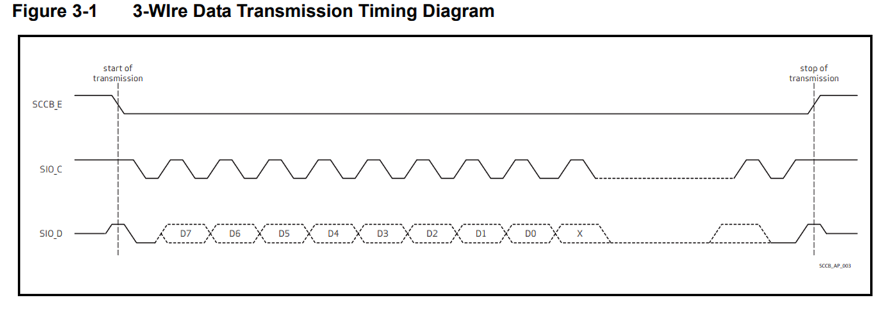
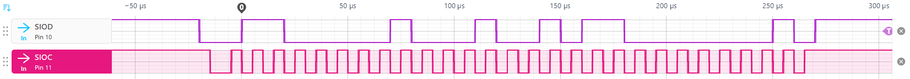

When this function failed to produce output from the OV2640, testing pivoted to the OV7675, which produced signals without data over SCCB. The datasheet for the OV7675 indicates that the output should follow the format shown below.

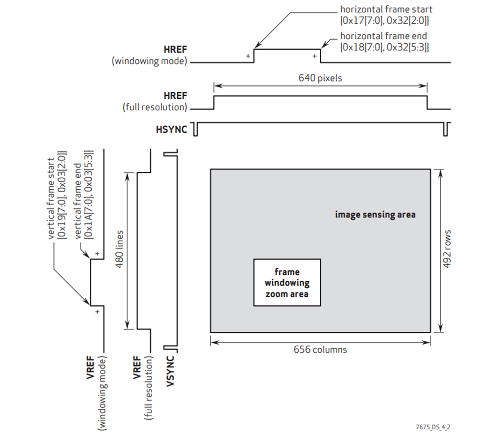

The MOKU output below shows the flawed OV7675 output. At this scale, the Vsync can be seen clearly. Based on the datasheet, the only "true" Vsync outputs occur as labeled above. To account for this discrepancy, the project ignores Vsync, instead opting to count Hsync pulses to reset frame. 

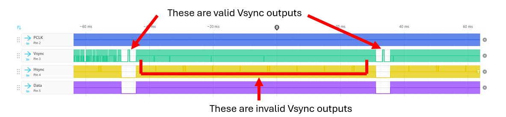

Manually counting the Hsync signals on the MOKU, there are approximately 492 pulses per Vsync, confirming that the camera output at least partially matches the datasheet. The Hsync pulses appear consistent. Further evidence of the corrupted Vsync can also be seen below in green.

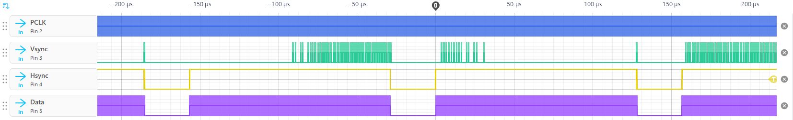

After writing the conversion from YUV to RGB, the conversion to PPM was tested. This produces the following 64x48 output. The output appears to be a torn and miscolored version of the "Test Pattern" from the datasheet, shown as a rainbow image below.

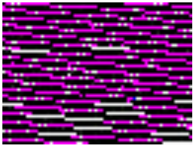
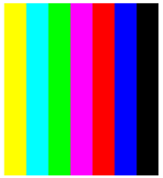

In one final attempt to get useful output, the 7675_capture module was hastily modified to read RGB565 values directly into BRAM. That is, the new assumption was that the camera outputs R, G, B in sequence. This produced the image below. Clearly the output is different, but does not necessarily represent an improvement. With no time left for testing, the project was reverted to the YUV conversion and testing was concluded. 

.png)

In conclusion, the project was nearly a complete failure. No useful output was retrieved from the OV7675 camera. Future recommendations are to avoid I2C based projects due to complexity and difficulty in troubleshooting. Having functioning outputs from the camera without initialization would have drastically reduced troubleshooting and would have made debugging easier. The camera's SCCB interface is effectively a black box. Students should not succumb to the sunk-cost fallacy and should attempt interfacing with hardware that can be easily verified to work correctly.

## Appendix A: Running the Project
Download the design_1_wrapper.xsa file and create a new application project in Vitis classic 2024.2. Select the hello world example. Delete line 8 of the MicroBlaze makefile, then copy the contents of \final_project\final_project_6\src\helloworld.c into the new helloworld.c file. Build the project, then export the project to the Nexys Video. Follow the wiring diagrams to connect the OV7675 breakout board. Connect the UART and PROG USB cables to a computer. Connect the HDMI output to an HDMI monitor or television. To use the MicroBlaze commands, open a UART terminal in Vitis and type shift + '?' to print the menu.

### Wiring Diagram
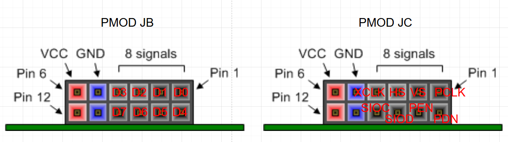

## Appendix B: Documentation Statement

I used generative AI extensively for troubleshooting and writing code. Most of the initial code and designs were mine, but, as the project progressed, more of the code was overwritten by AI and additional features were added. The links to my AI logs are given below.

https://chatgpt.com/share/6a0048fd-b84c-83e8-8787-7815be36400d
https://chatgpt.com/share/6a00490a-ccf8-83e8-93d2-5d8cc058c1d2
https://claude.ai/share/8bfb3b44-1b65-4bb8-9f28-614dcd89327f
https://claude.ai/share/e2dd5aaf-90bc-46fb-ab3f-59f8cd4af0ae
https://claude.ai/share/4fde238c-439c-4bf3-9714-a403f16b318d
https://claude.ai/share/868c27aa-c6a0-4e11-b230-229f20fe4e0e
https://auth.cloud.google/signin/locations/global/workforcePools/genai-mil-gemini-prod/providers/genai-mil-gemini-prod-provider?continueUrl=https://vertexaisearch.cloud.google/us/home/cid/f5df5665-52d6-4e1b-8f7d-ddb6a2fd450d/r/share/c7286b69-de66-41aa-bbab-9260e2d5e869?csesidx=679273114
https://auth.cloud.google/signin/locations/global/workforcePools/genai-mil-gemini-prod/providers/genai-mil-gemini-prod-provider?continueUrl=https://vertexaisearch.cloud.google/us/home/cid/f5df5665-52d6-4e1b-8f7d-ddb6a2fd450d/r/share/7c2b4d8d-c4f3-4c7a-ad6f-80c17b0ccf10?csesidx=679273114
https://auth.cloud.google/signin/locations/global/workforcePools/genai-mil-gemini-prod/providers/genai-mil-gemini-prod-provider?continueUrl=https://vertexaisearch.cloud.google/us/home/cid/f5df5665-52d6-4e1b-8f7d-ddb6a2fd450d/r/share/5971f94b-8bdb-4e52-9958-e4d53acb831b?csesidx=679273114