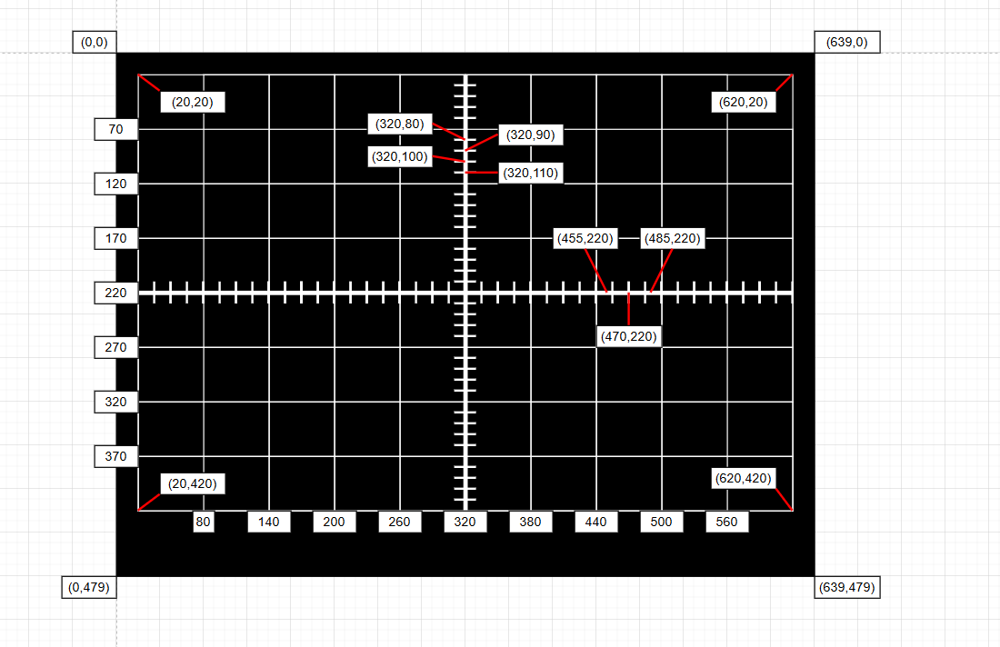
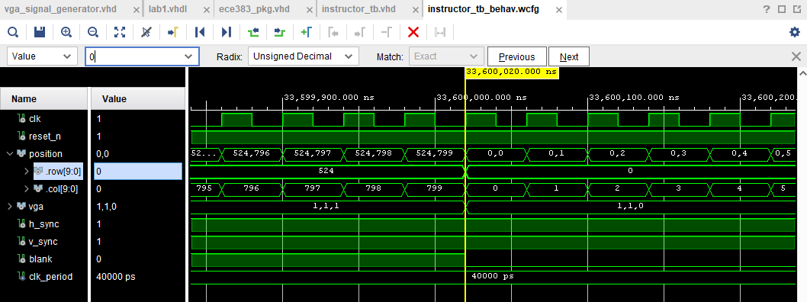
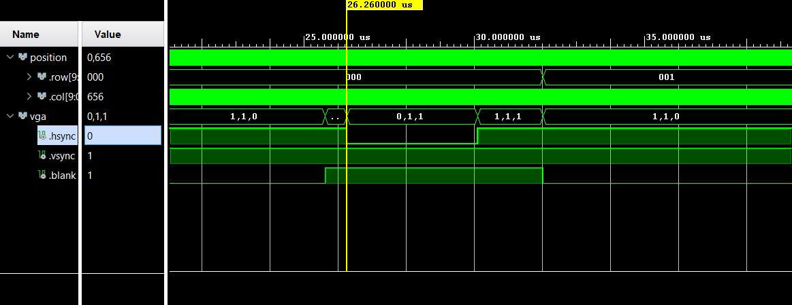
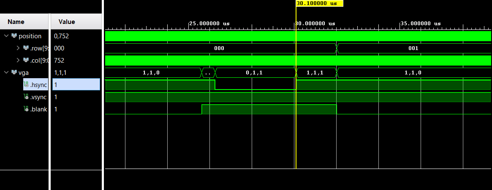
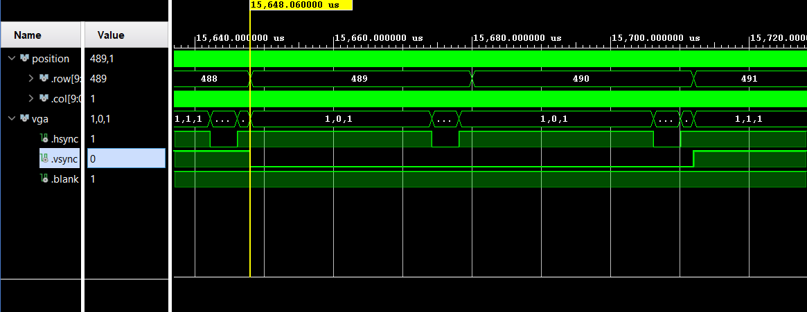
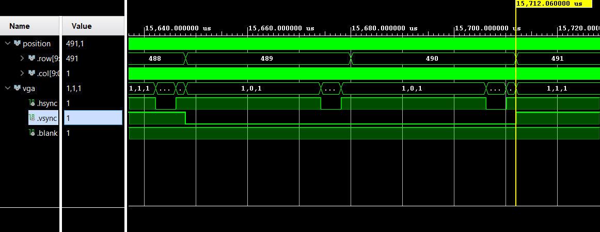
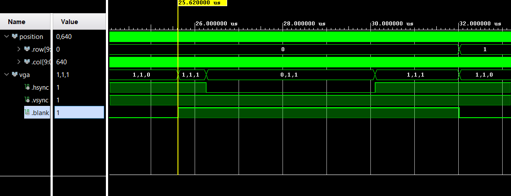
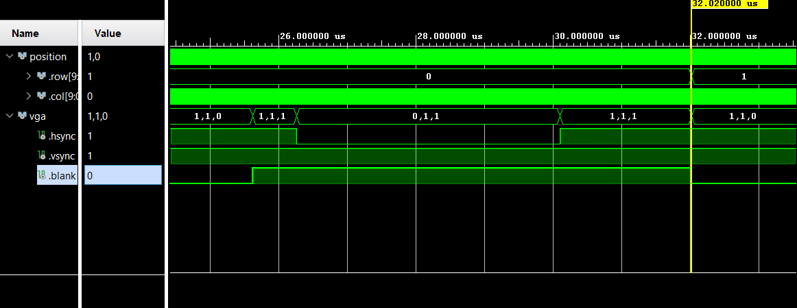
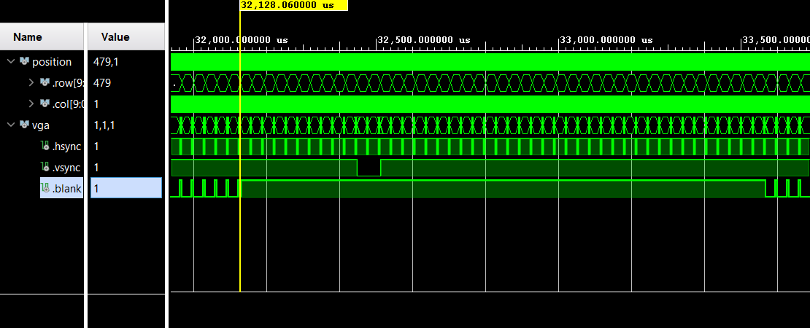
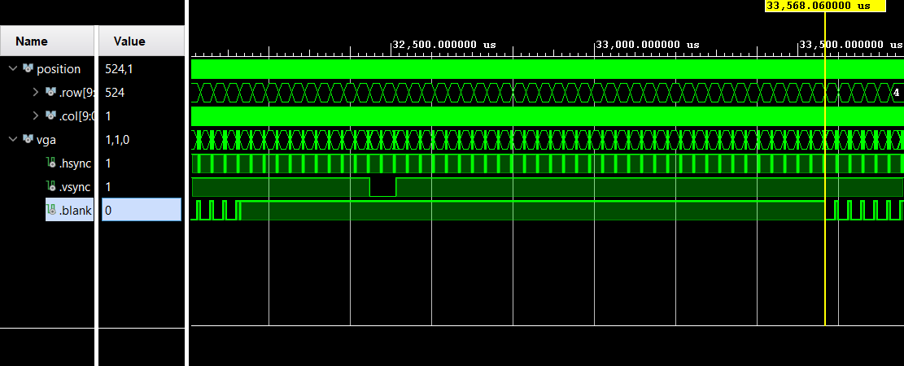

# ECE383 Lab 1
### Bradford Hurt
***

## Introduction
This lab uses a NexysVideo FPGA board to generate a VGA signal and display a grid framework for future use in oscilloscope projects. The screen displays a 600x400 pixel grid on which two channels are printed: channel 1 in yellow and channel 2 in green. For testing purposes, these channels are hard-coded to create horizontal lines. Additionally, indicators are placed along the vertical and horizontal axes for use as triggers. The grid displays minor gridlines of 10 vertical lines by 8 horizontal with hatch marks to indicate every 10 pixels on the vertical axis and 15 in the horizontal axis.

## Design / Implementation 
First, I created a diagram of the grid, labeling each coordinate. The spacing for the grid and its placement on the screen are shown in the figure below where (0,0) represents the top left corner of the VGA display. All other major coordinates are listed, along with several hatch mark coordinates to describe spacing.

To implement this design, the components were arranged as shown in the block diagram.
.jpg>)
### Component Functionality
#### Prebuilt components include:
##### Video
The video component connects the top level design in Lab1 to the VGA and Clock Wizard components. It also contains the DVID component.
##### Clock Wizard
The Clock Wizard handles the clocks for the DVID component, synchronizing its output with the VGA signal.
##### DVID
The DVID component converts the VGA signals from the VGA module to an HDMI signal. The DVID outputs become the outputs of the Video component.
#### New components for this project are:
#### Lab1
Lab1 is the top-level design that integrates two numeric steppers, the video component, and the hard-coded logic to test channels 1 and 2. The two numeric steppers, named num_step_t and num_step_v, control position of the time and voltage triggers using input from the up, down, left, and right buttons on the NexysVideo. Lab1 also maps inputs from the NexysVideo reset button and switches 0 and 1 into the Video component. It takes the output of Video and maps it to the board's HDMI output.
#### Numeric Stepper
Numeric stepper takes two control inputs, a reset input, and an enable. The two inputs control a counter which steps up or down only once for each button press. Holding down a button will not cause the stepper to increment or decrement more than once. The component has generic values max_value and min_value which control the range of outputs the stepper can generate.
#### VGA
The VGA component connects the uses the pixel clock from the Clock Wizard and connects the trigger coordinates and channel signals to the Color Mapper component to determine what should be printed at each pixel coordinate. VGA also contains the VGA Signal Generator which determines the location each color will print to.
#### VGA Signal Generator
The VGA Signal Generator takes the pixel clock from VGA and generates a pixel coordinate in terms of row and column. It also outputs h_sync, v_sync, and blank, the signals that control vga timing. These outputs are routed to the Color Mapper and DVID to determine the color and location of each pixel on the screen.
#### Color Mapper
The Color Mapper takes the pixel coordinate information from the VGA Signal Generator and calculates what color should be at each location. It also takes the Channel 1 and 2 signals and prints a different color for each channel at the correct locations. Color Mapper contains the information from the Grid Layout figure. The location of the printed grid along with hatch marks is determined within Color Mapper.

## Test / Debug
The VGA Signal Generator was the first module tested using a pre-made instructor testbench. The column counter runs from 0 to 799 and the row counter, which increments once for every column cycle, runs from 0 to 524. The following waveform shows both counters rolling over from their maximum values back to 0.

The second testbench ensured that the h_sync, v_sync, and blank signals aligned with VGA standards. The signals were calculated based on the pixel coordinate information generated in the previous testbench. As shown in the following screenshots, the three VGA control signals change at the desired times.
h_sync is

v_sync is

blank is

## Results

## Conclusion