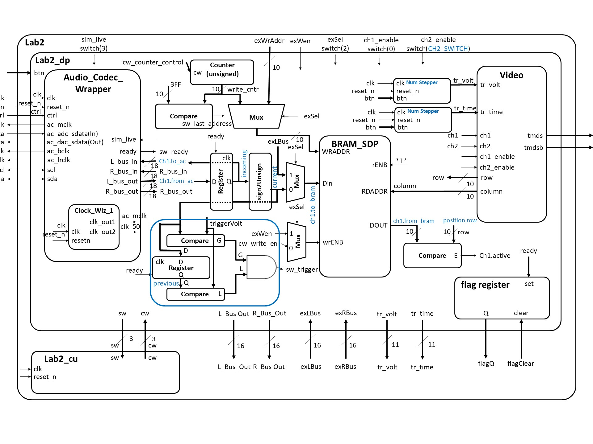

# ECE383 Lab 2
### Bradford Hurt
***

## Introduction
This lab integrates the VGA video controller from Lab 1 with the Nexys Video's Audio Codec to build a basic two-channel oscilloscope. The oscilloscope shows the audio waveform centered vertically on the grid from Lab 1. The waveform for channel 1 begins at the trigger on the vertical (voltage) axis and is shown in yellow. Channel 2 appears in green, and both channels can be toggled by the Nexys Video switches. Simulated and live audio input can also be toggled with the switches. The horizontal (time) trigger moves but has no functionality.

## Design / Implementation 
To allow the audio codec and video output to operate independently, the BRAM is used to store the audio waveform displayed on the screen. As the audio data comes from the Audio Codec Wrapper, it is routed back into the Codec so it can be output from the Nexys Video's second audio port and monitored through a speaker. The signal is also processed, making it unsigned and truncating the least significant bits. This allows it to be compared with the trigger voltage and allows scaling to fit within the screen. Values written to memory are translated directly to vertical coordinates on-screen. Additionally, a counter is used to determine when the audio written to the BRAM has reached the end of the screen. When that occurs, the counter resets and the waveform is again written to memory from left to right. The Video module works independent of the Audio Codec Wrapper. The current column coordinate of the Video module is used as an index for the BRAM. Thus, as Video iterates through on-screen columns, it accesses the row where the incoming audio signal should be displayed. The triggers are controlled with two external numeric steppers, built in Lab 1. Note that, on the block diagram, sections using channel 1 names beginning with "Ch1." have duplicates for channel 2.
### Block Diagram:

### State Transition Diagram:
.jpg>)
### Component Functionality
#### Prebuilt components include:
##### Video
The video component connects the top level design in Lab1 to the VGA and Clock Wizard components. It also contains the DVID component.
##### Numeric Stepper
Numeric stepper takes two control inputs, a reset input, and an enable. The two inputs control a counter which steps up or down only once for each button press. Holding down a button will not cause the stepper to increment or decrement more than once. The component has generic values max_value and min_value which control the range of outputs the stepper can generate.
##### Audio Codec Wrapper
The Audio Codec Wrapper translates input from the Nexys Video's audio port to usable 18 bit signed numbers.
##### BRAM Wrapper
The BRAM wrapper allows access to the Nexys Video's BRAM and allows simultaneous reading and writing.
##### Counter
The counter has generic values num_bits and max_value which can be used to set the maximum value for the counter. It increases its Q output every clock cycle and rolls over when it reaches the maximum value.
#### New components for this project are:
#### Lab2
Lab2 is the top-level design that integrates the Video and Audio Codec Wrapper into a 2-channel oscilloscope. It utilizes numeric steppers to control the video position, BRAM to store audio, and a trigger detector to determine when to write to the screen.
#### Trigger Detector
The trigger detector takes values for the trigger threshold and the monitored signal. It outputs a '1' when the trigger threshold is between the current monitored signal value and previous monitored signal value.

## Test / Debug
Implementation of Lab 2 was done in stages to ensure smooth testing and that the prebuilt modules work. This allowed most problems to be resolved easily. Gate Check 1 included the Video and BRAM modules, with hard-coded data for the BRAM. Gate Check 2 added simulated values from the Audio Codec Wrapper along with a counter for writing to the BRAM. The final addition included trigger logic and live audio input.
### Major Problems
When testing the live output, I noticed that my waveforms were considerably less crisp than those from the other students. Every wave except for the Sine wave was blurry and distorted.

I resolved this issue by using another student's laptop to output the audio signal. The issue was with the output from my computer rather than the project.

During testing of the trigger, I ran into several issues while comparing the incoming signal to the threshold. Each time, the type error was wrong or the number of bits was incorrect.

The solution was to take the top 9 bits, convert to a standard logic vector, and use the apply_offset function from the 383 library to acheive the correct comparison.

## Results
The final results are fully demonstrated in the demonstration video uploaded to Teams. Milestones with date of completion are listed in the table below.

| Milestone | Date | Achievement |
| --- | --- | --- |
| Gate Check 1 | 13 Feb | Demonstrated lab#1 worked with the two test signals in the BRAM displayed on scopeface monitor and buttons working. |
| Gate Check 2 | 18 Feb | See video on teams showing the two simulated audio signals scrolling on monitor (not triggered) |
| Gate Check 3 | 22 Feb | Demo’d to instructor audio loopback test and the live audio waves with triggering |
| A-Level Functionality | 22 Feb | Demo’d to instructor the live audio test with triggering. Successfully moved the waveform on the screen with the debounced trigger. |

## Conclusion
I learned that state machines are less straightforward than they seem at first glance. While several years of computer science experience have made me comfortable with the mini-c format, converting to states leaves me confused. While I feel like I am improving at the process, I could stand to practice it more. However, the actual programming for this lab was more straightforward than Lab 1. A combination of recalling forgotton VHDL syntax and a detailed block-diagram made Lab 2 easier. I would not recommend any changes to this lab.