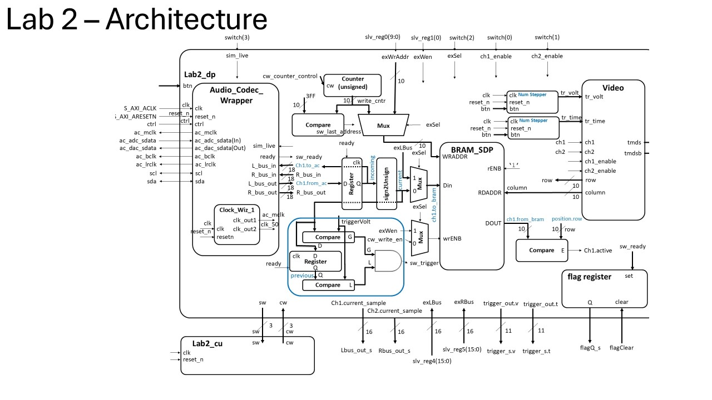
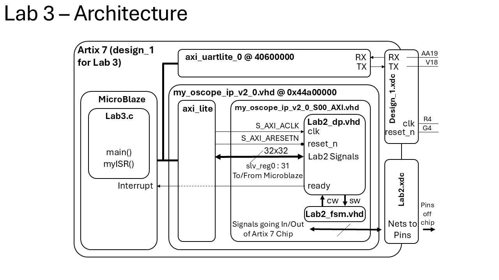

# ECE383 Lab 3
### Bradford Hurt and Dominick Lisitsin
***

## Design: Block Diagrams
### Lab 2 Block Diagram
#### Oscilloscope hardware architecture including the datapath and control unit. The diagram shows signals connected to external ports to interface with MicroBlaze.

### Lab 3 Block Diagram
#### Architecture diagram showing the DP and CU from Lab 2 interfacing with MicroBlaze through an axi_lite bus using a UART protocol.

## Design: AXI Register Mapping
#### The first table shows connections between the Lab 2 signals and axi_lite registers. The second table shows the Artix 7 constraint file configuration for interfacing with Nexys Video hardware.

## Functionality
The final results are fully demonstrated in the demonstration video uploaded to Teams. Milestones with date of completion are listed in the table below.

| Milestone | Date | Achievement |
| --- | --- | --- |
| Gate Check 1 | 12 Mar | Determined that trigger and enable controls would be left on the Nexys Video. Revised Lab 2 Block Diagram. Created AXI register mapping. |
| Gate Check 2 | 18 Mar | Implemented Lab 2 functionality inside a custom IP connected to MicroBlaze. |
| Gate Check 3 | 23 Mar | Demo'd to instructor sending flag reset commands and reading values from the AXI registers.|
| A-Level Functionality | 2 Apr | Demo’d to instructor the oscilloscope properly shifting the waveform in MicroBlaze to the intersection of the time and voltage triggers. Created a menu displaying testing options. During continuous operation, printed the current position of the time and voltage triggers.|

## Conclusion
I learned that state machines are less straightforward than they seem at first glance. While several years of computer science experience have made me comfortable with the mini-c format, converting to states leaves me confused. While I feel like I am improving at the process, I could stand to practice it more. However, the actual programming for this lab was more straightforward than Lab 1. A combination of recalling forgotton VHDL syntax and a detailed block-diagram made Lab 2 easier. I would not recommend any changes to this lab.